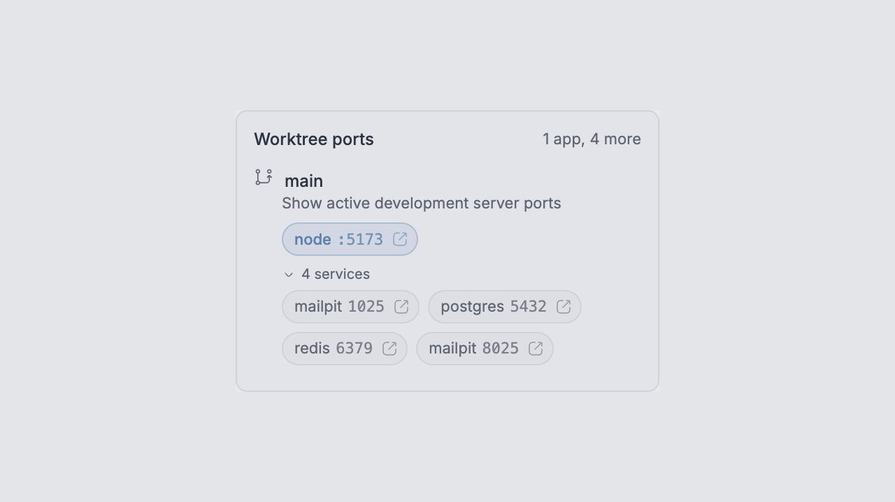
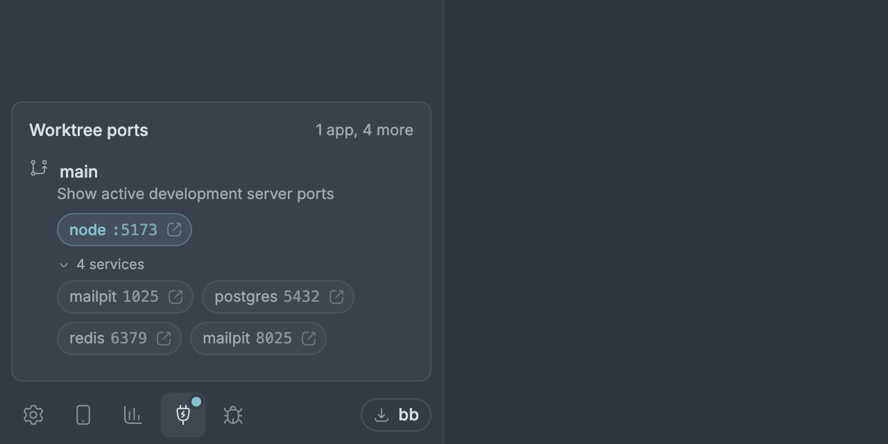

# Worktree Ports

Shows what each BB worktree is serving, in the sidebar footer. Click a port
pill to open it.





## How ports are found

Discovery is live and needs no per-worktree configuration. On every scan the
host worker for each machine:

1. reads listening TCP sockets (`lsof -nP -iTCP -sTCP:LISTEN`),
2. resolves each listening process's working directory (`/proc/<pid>/cwd` on
   Linux, a second `lsof` pass on macOS) and attributes it to the worktree
   containing it — longest path match, so a nested chain worktree is its own,
3. attributes published Docker ports through the compose project's
   `com.docker.compose.project.working_dir` label, which is the only way a
   container's ports reach the worktree that started them,
4. labels what it found from the worktree's `ports.json`,
5. gives each port a role: **app** (the thing to open), **service** (a
   backing store), or **internal** (a loopback listener on an ephemeral port,
   such as an agent's own RPC socket).

A labelled port is always an app. A Docker published port is a service, as is
anything owned by a known database process or on a well-known service port
(5432, 6379, 7687, 27017, …). A loopback listener at or above 49152 is
internal. Everything else is an app. To promote a service or internal port,
label it in `ports.json`.

Attributing by working directory means a dev server that an agent started in
the background — reparented to PID 1, no controlling terminal — is still found.

## Surfaces

- **Sidebar footer** — a disclosure grouped by worktree: branch, thread, then
  one accent-blue pill per app port showing its name and port (`anton :8080`).
  Services and internal listeners sit behind a muted "7 services, 1 internal"
  toggle, expanded by default only when a worktree has no app port. Hovering
  any pill reveals a stop button.
- **Footer button dot** — a blue dot sits on the footer button itself while
  anything is listening, so the card announces itself without being open. It is
  painted onto the host's button from a content script (the registration API has
  no badge field) and re-applies itself if BB re-renders the footer.
- **Sidebar thread rows** — threads whose worktree has a listener get a glyph;
  its tooltip names the app ports and counts the rest. Turn off with the "Mark sidebar threads" setting.
  Only BB's built-in thread list draws these: a plugin that replaces the list
  through `experimental_threadList` (such as `bb-sidebar`) renders its own rows,
  and plugin row statuses do not appear there.
- **`bb ports list [--json]`** (app ports first, then `service:` and
  `internal:` sections), **`bb ports release <env-id> <port>`**.
- **`worktree_ports` agent tool** and the `worktree-ports` skill.

## Opening a port

A plain click follows the **Open ports in** setting: `BB browser preference`
hands the URL to BB, which honors whatever in-app/external preference that
client already has; `System browser` opens it outside BB. ⌘/Ctrl-click does
the other one. Forcing the *in-app* browser against a client whose preference
is external is not possible — BB owns that tab kind and exposes no API for it.

## Labels

Commit `.bb/ports.json` (or reuse an existing `.superset/ports.json`):

```json
{
  "ports": [
    { "port": 3000, "label": "Frontend" },
    { "port": 4443, "label": "API", "scheme": "https" }
  ]
}
```

Discovery stays authoritative: labels only name ports already listening,
entries for ports that are not listening are ignored, and a malformed file
labels nothing rather than hiding ports. Without an explicit `scheme`, ports in
the 443 family are assumed HTTPS.

## Settings

| Setting | Default | |
|---|---|---|
| Scan interval (seconds) | 3 | 1–60 |
| Include Docker published ports | on | |
| Ignore ports | — | comma separated |
| Ignore processes | — | comma separated, matched on the process name |
| Open ports in | BB browser preference | or System browser |
| Mark sidebar threads that have listening ports | on | |

## Limits

- macOS and Linux. The scanner needs `lsof`; Windows is not supported.
- Ports are listed for the machine each worktree lives on. A remote host's
  `localhost:PORT` is not forwarded to your machine — use `bb connect`, SSH, or
  Tailscale for that.
- Only processes visible to the daemon's user are attributed.

## Development

```bash
npm install --include=dev
npm test          # parsing and attribution
npm run typecheck
bb plugin build && bb plugin install . --yes
```
